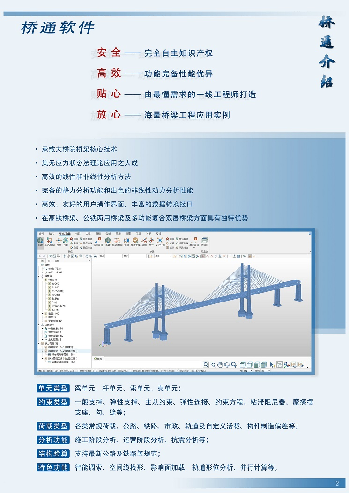

## 01. Introduction to Qiaotong Software

Qiaotong is a general-purpose finite element analysis software for bridges, independently developed by China Railway Major Bridge Reconnaissance & Design Institute Co., Ltd. (hereinafter referred to as "MBEC"). The software inherits the core technologies of MBEC, offering comprehensive features and outstanding performance. It is suitable for the entire process of structural analysis for any type of bridge, from design and construction to operation and maintenance. Qiaotong supports industry standards for highways, railways, and municipal engineering, and is widely used in design, construction, and research organizations. The name "Qiaotong" not only summarizes the software’s capabilities but also carries forward the pioneering spirit of the Wuhan Yangtze River Bridge, encapsulated in the phrase: "A bridge flies over the north and south, turning a natural moat into a thoroughfare."

Developed for the Windows environment, Qiaotong integrates modules such as an interactive modeling interface, a 3D graphics engine, a dynamic bidirectional 2D graphics engine, efficient database access technology, excellent solver performance, and powerful post-processing capabilities. Created by front-line engineers, the software is tailored to practical needs. Its user interface seamlessly aligns with commercial software, requiring no change in user habits and enabling zero-cost onboarding. Data formats are mutually recognized and convertible with commercial software. The finite element computation core of Qiaotong has been validated over decades and hundreds of bridge projects, ensuring accurate and reliable results.

## 1.1 Software Environment

The software has been tested and verified on the following operating systems: Windows 8, Windows 10, and Windows 11. It requires Microsoft .NET Framework 9.0 as its runtime environment.

## 1.2 Software Installation, Operation, and Uninstallation

- **Download:** [Click to download](https://www.brdi.com.cn/list/91.html "https://www.brdi.com.cn/list/91.html")
- **Installation:** Run Setup.exe in the installation package to start the installation. If Microsoft .NET Framework 4.8 is not installed, you will be prompted to install it before proceeding. The default installation path is: C:\\Program Files\\BRDI\\Qiaotong\\, but users can change it as needed. After installation, shortcut icons will be created on the desktop and in the Start menu.
- **Uninstallation:** Go to Start > All Programs > Qiaotong > Uninstall.
- **Online Upgrade:** We provide an online upgrade feature for software version updates. You can choose to overwrite the existing installation or perform a fresh installation as needed.

## 1.3 Software Features

[Video introduction to software features](https://www.bilibili.com/video/BV1ap4y1T7Zz/?share_source=copy_web&vd_source=c556459924185cc3d2902367720ea181)

