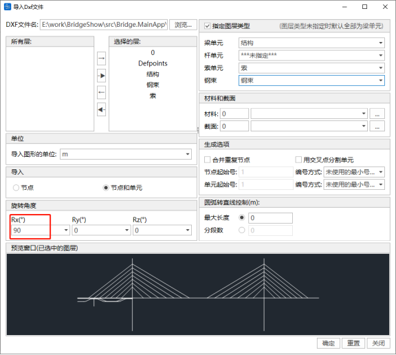
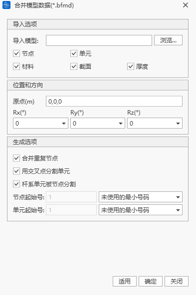

# 03. Project, File, and Data Management

## 3.1 Basic Operations

### Create New Project
- Command: Main Menu > File > New
- Toolbar Icon: 
- Shortcut: Ctrl+N

After clicking "New Project", the software will automatically create model data.

### Open Project
- Command: Main Menu > File > Open
- Toolbar Icon: 
- Shortcut: Ctrl+O

Selecting "Open Project" will bring up a file dialog. Choose the desired \*.bfmd project file and click "Open" to load the project.

### Open Project Directory
- Command: Main Menu > File > Open Project Directory
- Shortcut: Ctrl+P

Select a \*.bfmd project file to open the corresponding project directory.

### Save/Save As
- Command: Main Menu > File > Save/Save As
- Toolbar Icons:
  
  
- Shortcut: Ctrl+S

Save the current project to the database. The first time you save, you need to enter the project name and file path. Saving an existing project will overwrite the current project. If you select "Save As", you will need to enter a new project name and path to save as a new database.

### Close Project
- Command: Main Menu > File > Close
- Toolbar Icon: 

Close the current project. If the project data has been modified, a dialog will appear before closing, asking whether to save changes. If you choose "Yes", the data will be saved automatically; if "No", changes will not be saved.

### Save Current Stage As
- Command: Main Menu > File > Save Current Stage As
- Toolbar Icon: 

You can save the model at the current construction stage as a separate file, which is generally used for analyzing a specific construction stage independently.

### Recently Opened Models
- Command: Main Menu > File > Recently Opened Models
- Toolbar Icon: 

The list of recently opened models will display the three most recently used project file names. Select a \*.bfmd file to open the corresponding project.

### Exit
- Command: Main Menu > File > Exit
- Toolbar Icon: 

Exit the application and close all processes directly.

## 3.2 Import and Export

### Import Midas Data
- Command: Main Menu > File > Import > MIDAS(.mct)

Select a Midas (.mct) model file and double-click to import the model. Only versions 9.1.0 and 9.3.0 are supported.
- For unsupported content, please refer to the error message.

### Import Dxf Graphics
- Command: Main Menu > File > Import > Dxf File (.dxf)

A dialog will pop up for importing Dxf files. Select the DXF file, choose the drawing layers, select which data to import (nodes, elements, materials, sections, etc.), set the rotation angle, and preview the imported graphics in the preview window. Click "OK" to import the graphics.
If you need to convert the Y-axis in the dxf to the spatial Z-axis, set the Rx rotation angle to 90°.

### Export Midas Data
- Command: Main Menu > File > Export > MIDAS(.mct)

Enter a file name to export as a Midas model file, which can be opened in Midas software.
- For unsupported content, please refer to the error message.

### Export 3DBridge Data
- Command: Main Menu > File > Export > 3DBridge (.3db) File

Enter a file name to export as a 3DBridge (.3db) file, which can be opened in the self-developed 3DBridge software by MBEC.

### Merge Models
- Command: Main Menu > File > Merge Models (\*.bfmd)

Merge the current model data file with other model data files. Click "Browse" to select the model to be merged, and it will be merged into the current model.

Merged model information includes nodes, elements, materials, sections, and thickness. When merging, you can select the model's starting point and rotation directions Rx, Ry, Rz. In the generation options, you can set options for merging duplicate nodes, intersection splitting, and provide numbering methods for nodes and elements.

## 3.3 Project Information

Click "Project Information" to open the general settings window. In the calculation information section, enter the project name, design organization, calculation personnel, and review personnel. In the basic data section, set the gravity acceleration and design temperature. Fill in a detailed project description to complete the project information setup.

## 3.4 File Management

After creating a new project, users should save it as soon as possible. Upon saving, a model database file (\*.bfmd) will be generated. After successful model calculation, a result folder named after the project will be created, containing various result files and intermediate data files.

| Module | File Name | File Type | Description |
|--------|-----------|-----------|-------------|
| Static Analysis Module | \*.bfmd | Model File | Contains finite element model information created by the user |
| | \*.bfmd.bak | Model Backup File | Automatically generated after saving |
| | Project Folder/ \*.srd | Result File | Construction stage result file |
| | Project Folder/ \*.erd | Result File | Construction envelope result file |
| | Project Folder/ \*.ard | Result File | Additional load analysis result file |
| | Project Folder/ \*.scrd | Result File | Bearing settlement analysis result file |
| | Project Folder/ \*.mrd | Result File | Moving load analysis result file |
