# 05. 结构

## 5.1 项目信息

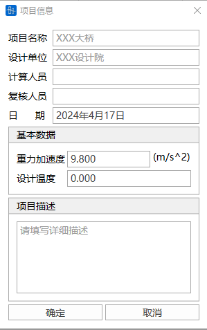

详见[3.3 项目信息](../03-management/#33-项目信息)

## 5.2 检查结构

### 5.2.1 显示重复单元

- **功能**：显示模型重复的单元
- **命令**：从主菜单中选择"结构" > "显示重复单元"

### 5.2.2 删除重复单元

- **功能**：删除模型重复的单元
- **命令**：从主菜单中选择"结构" > "删除重复单元"

## 5.3 悬索桥助手

### 5.3.1 空间缆找形

详见[18. 空间缆索找形](../18-cable-finding/#18-空间缆索找形)

## 5.4 横向分析建模助手

- **功能**：可通过选择具有参数化混凝土箱梁截面的单元，快速将单元截面划分成横向有限元模型
- **命令**：从主菜单中选择"结构" > "横向分析建模助手"

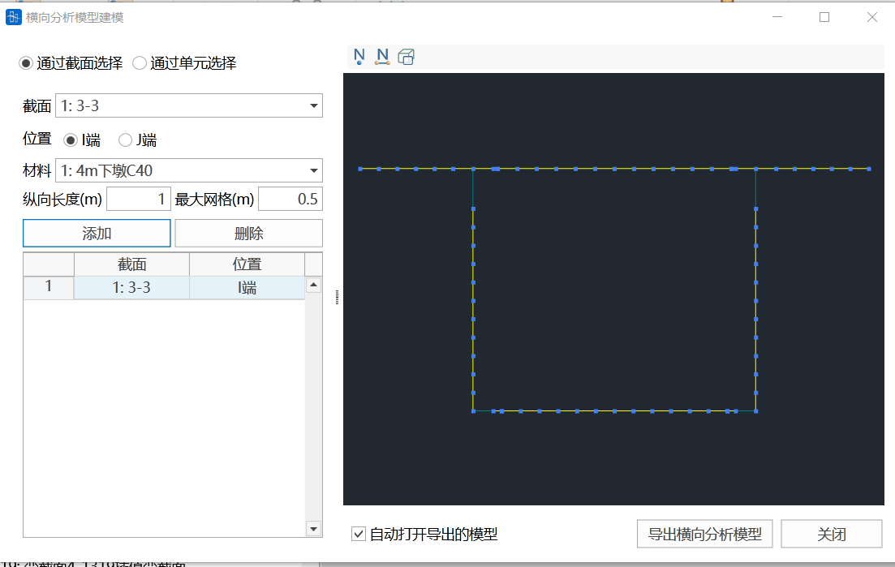

### 输入参数

#### 通过截面选择

软件将在截面下拉框列出截面库中所有参数法混凝土箱梁截面，在右侧窗口显示箱梁截面的轮廓图。选择单元截面的I端或J端，选择单元材料，单击添加，软件自动生成对应混凝土箱梁截面的有限元模型，并在右侧窗口显示。可显示节点号、单元号及渲染图。

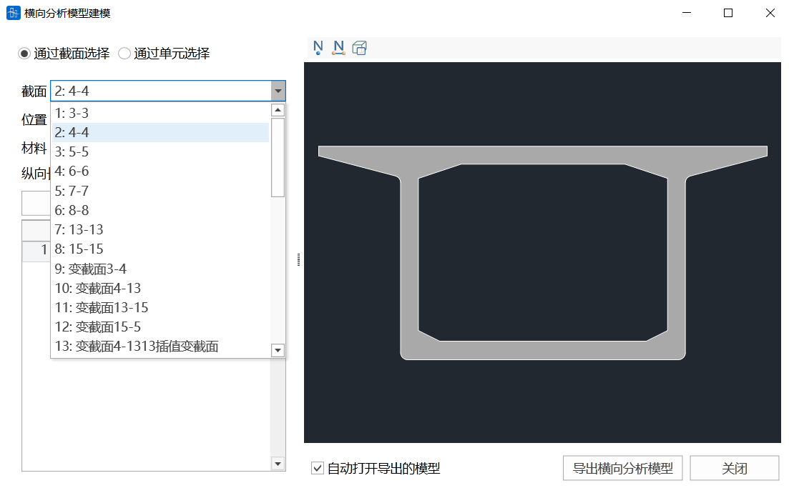

#### 通过单元选择

可手动输入一个单元号，选择单元截面的I端或J端，及单元材料，单击添加，软件自动生成对应单元位置截面的有限元模型，并显示在右侧窗口。可显示节点号、单元号及渲染图。也可通过

按钮，在桥通主界面中选择一个单元，软件将自动添加有限元模型。添加后的单元将列在左下方的列表中。

#### 位置

当"通过截面选择"时，对于变截面，可选择需要生成变截面I端或者J端的截面有限元模型。当"通过单元选择"时，可选择单元的I端或J端截面生成有限元模型。

#### 材料

当"通过截面选择"时，需在"材料"下拉框中选择截面有限元模型的材料类型。当"通过单元选择"时，单元的材料即截面有限元模型的材料类型，无需再进行选择。

#### 纵向长度

该值用于确定生成的横向有限元模型的纵向长度，默认值为1m。用户可根据需要调整。

#### 最大网格

该值用于确定生成的横向有限元模型的单元长度，默认值为0.5m。用户可根据需要调整。

#### 导出横向分析模型

该功能用于将表格中当前所选的单元位置对应的截面导出为桥通有限元模型。用户需选择保存目录。当选择了"自动打开导出模型"选项，软件将在保存数据后自动打开桥通有限元模型。

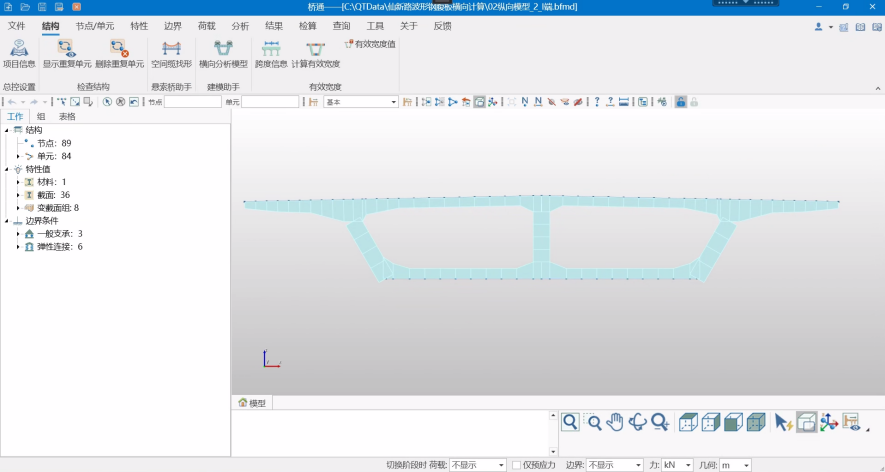

## 5.5 有效宽度

### 功能说明

可对跨度信息中定义的结构主梁单元自动进行有效宽度的计算，得到单元截面竖向抗弯惯性矩及形心位置的修正系数，用于考虑截面有效宽度。对于混凝土箱梁参数截面，软件自动计算有效宽度。对于自定义线圈截面，可通过自行定义翼缘线，腹板线确定截面的翼缘位置及翼缘宽度后，软件自动计算有效宽度。

### 5.5.1 跨度信息

- **功能**：定义结构的跨度信息，用于计算有效宽度
- **命令**：从主菜单中选择"结构" > "跨度信息"

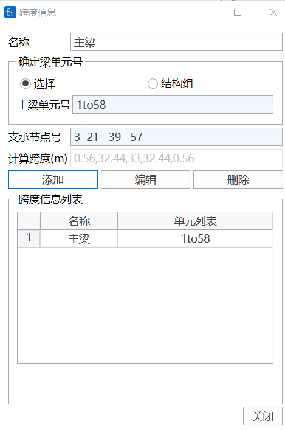

#### 输入参数

##### 名称

输入当前跨度信息的名称。

##### 确定梁单元号

- **选择**：光标定位到"主梁单元号"文本框后，在图上选中需定义跨度信息的梁单元起点和终止节点，软件自动将对应的单元号填充到文本框中。

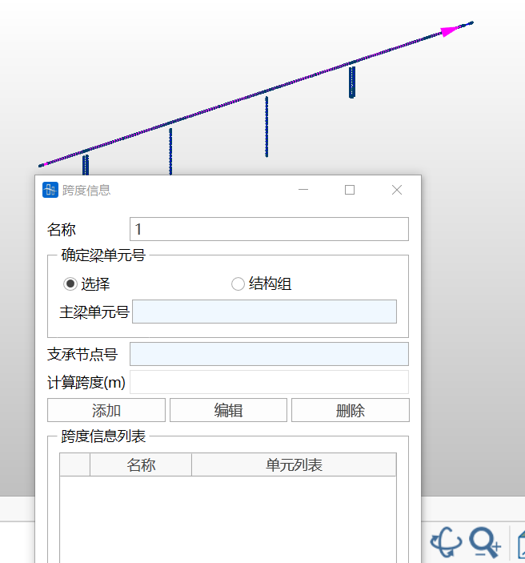

- **结构组**：选择组成需定义跨度信息的梁单元结构组，软件自动将对应的单元号填充到文本框中。

- **主梁单元号**：可通过"选择"或"结构组"自动填充，可以手动输入单元号
- **支承节点号**：用户手动输入支承节点号，以确定跨度信息定义对应的梁单元结构的边界条件

##### 计算跨度

软件将根据以上输入的主梁单元号及支承节点号，自动计算出计算跨度值，用于计算有效宽度值。用户不能进行修改。若需修改，则需对支撑节点号进行修改。

##### 跨度信息列表

软件可根据需要定义多组跨度信息。列于表中。

### 5.5.2 自定义截面翼缘宽度

- **功能**：对于自定义线圈截面类型，可采用该功能通过自行定义翼缘线，腹板线的方式，确定截面的翼缘位置及翼缘宽度，用于软件后续自动计算有效宽度
- **命令**：从主菜单中选择"结构" > "自定义截面翼缘宽度"

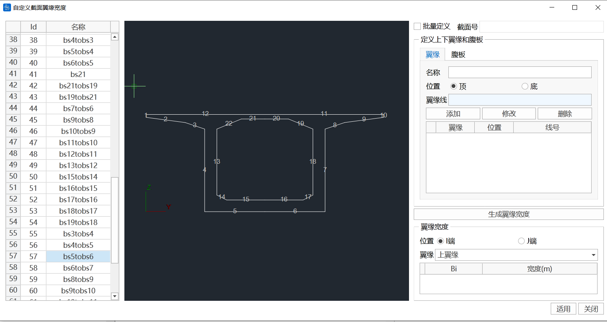

#### 输入参数

##### 截面列表

自动列出截面表格中所有自定义线圈截面，包括自定义线圈类型的变截面。

##### 批量定义

选择批量定义后，在左侧截面列表中选择多个截面，可进行批量定义。但需保证截面对应的线号一致。否则可能出错。

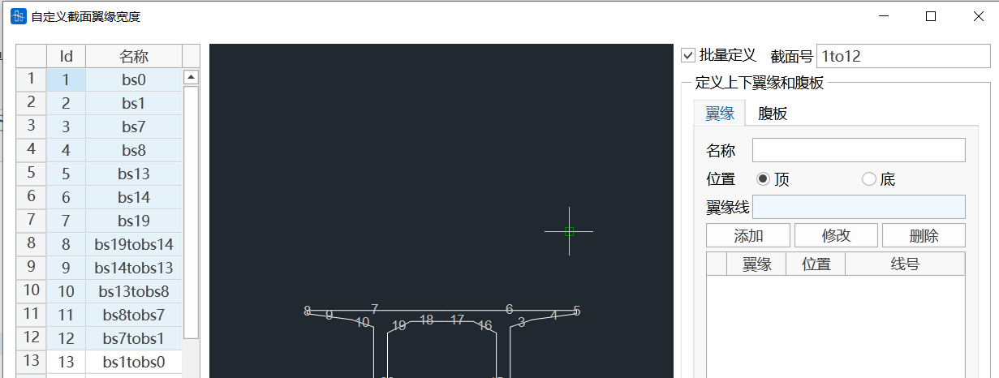

##### 定义上下翼缘和腹板

- **翼缘**：通过输入线号或图中选择线条的方式，分别定义截面翼缘的顶面线，底面线

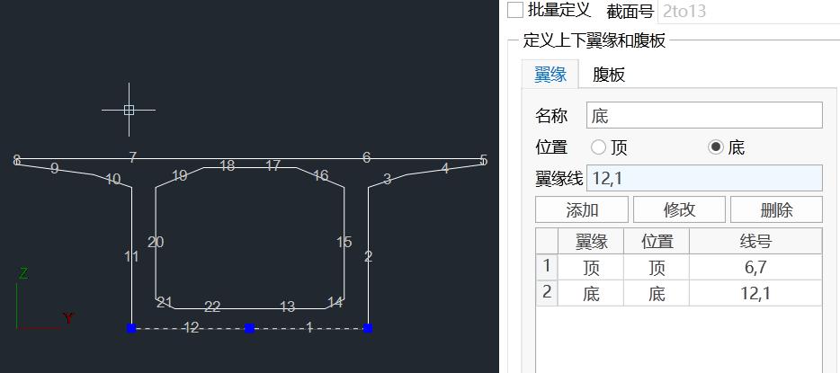

- **腹板**：通过输入线号或图中选择线条的方式，分别定义每道腹板的左腹板线，右腹板线，及腹板与翼缘交叉的方向

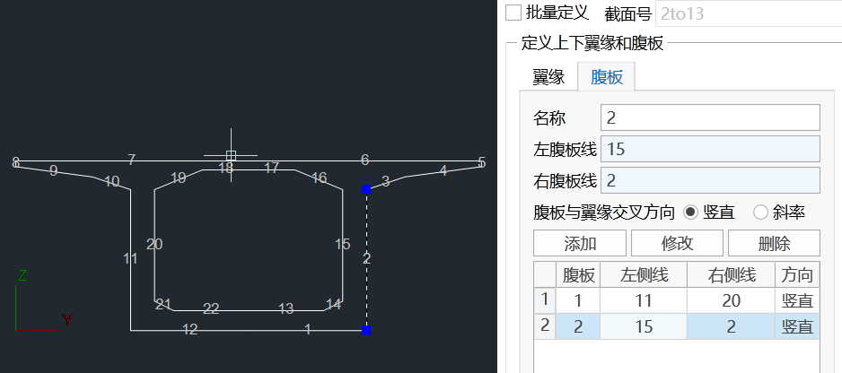

- **操作按钮**：
  - 添加：将已定义的翼缘，腹板添加到列表中
  - 修改：修改已定义好的翼缘，腹板
  - 删除：删除已定义好的翼缘，腹板

##### 生成翼缘宽度

软件自动生成上下翼缘的翼缘宽度，以供检查确认。对于变截面，可分别查看I,J端的翼缘宽度。

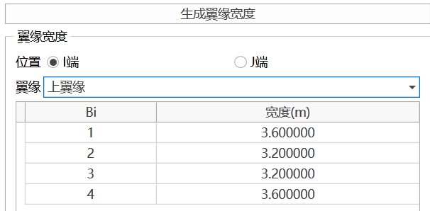

### 5.5.3 计算有效宽度

#### 输入参数

- **跨度信息**：选择需计算有效宽度的单元对应的跨度信息
- **设计规范**：软件提供《公路钢筋混凝土及预应力混凝土桥涵设计规范》（JTG 3362－2018）和《铁路桥涵混凝土结构设计规范》（J 462－2017）两种有效宽度计算方法
- **计算**：计算得到每个单元I端，J端的上下翼缘计算宽度，以及上下翼缘每一组成部分的有效宽度。同时绘制出有效宽度值沿跨度的变化图

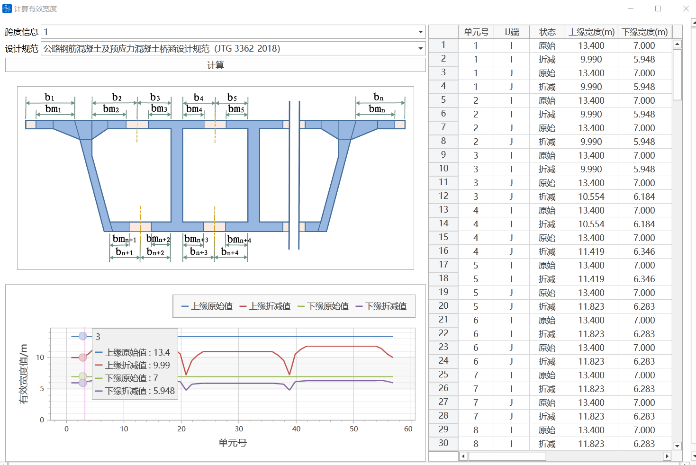

### 5.5.4 有效宽度系数表

在计算得到有效宽度时，软件同时计算得到单元I端，J端竖向抗弯惯性矩的修正系数"Iy系数"及形心变化的修正系数"Δz"，列于表中。

同时自动生成"EW边界组"。在施工阶段激活该边界组，则软件将考虑该阶段的截面有效宽度。

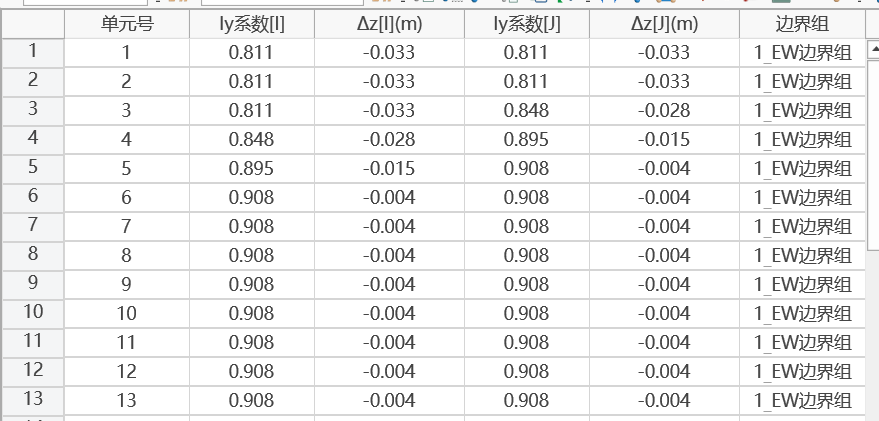

#### 计算说明

- **施工阶段应力计算**：以当前施工阶段的截面特性为基准，竖向弯矩My产生的应力考虑竖向抗弯惯性矩及形心修正系数的影响，其它内力产生的应力及温度自应力不考虑修正系数的影响
- **运营阶段应力计算**：以最后一个施工阶段的截面特性为基准，同样采用上述原则计算
