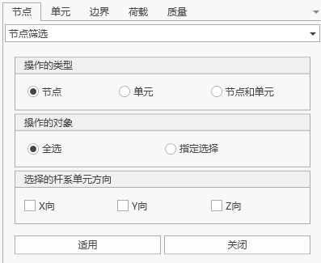

# 06. 节点、单元

## 6.1 坐标系

桥通软件包含多种坐标系，包括：整体坐标系、单元坐标系、节点坐标系、截面坐标系。

### 6.1.1整体坐标系

整体坐标系是用户打开软件后建模的基准坐标系即OXYZ坐标系，如图所示：

  

其中在默认的视角下：

Z轴沿屏幕竖向，从屏幕下方指向屏幕上方为正；

XOY平面垂直于Z轴，符合右手螺旋法则，用户可在建模过程中根据需要切换视角以提高建模的便利性。

### 6.1.2单元坐标系

单元坐标系（局部坐标系）是有限元计算的基础数据，桥通软件通过单元的节点及单元的特征角度（β角）共同确定。β角的含义：

> 当单元是线性单元(桁架，梁等)，指定β角或k节点的坐标定义构件的方向。如果输入k节点的坐标，则在程序内部自动计算构件布置角度并将其作为β角输入。在桥通中，线单元的单元坐标系x轴的方向为从N1点(i点)指向N2点(j点)。

当线单元的单元坐标系x轴和整体坐标系的Z轴平行时，单元的β角为整体坐标系X轴和单元坐标系z轴的夹角。夹角的符号由绕单元坐标系x轴旋转的右手法则决定。当线单元的单元坐标系x轴和整体坐标系的Z轴不平行时，单元的β角为整体坐标系Z轴和单元坐标系x-z平面的夹角。

  

  水平或倾斜构件(线单元的单元坐标系x轴和整体坐标系的Z轴不平行时)")

图4‑2单元坐标系

### 6.1.3节点坐标系

节点坐标系为可选定义项，主要适用于结构具有斜边界（约束的方向与整体坐标系斜交）的场景，此时用户可在这些节点上定义节点坐标系，并添加指定方向的约束，桥通为用户提供了便捷的节点坐标系定义功能。

### 6.1.4截面坐标系

截面坐标系主要用在截面创建模块，指示了截面沿宽度和高度两个方向的指向。当单元的β角为0时，截面坐标系与单元坐标系方向一致。

### 6.1.5 杆系单元内力坐标系

  正负号约定")

桥通软件根据用户习惯，对杆系单元的内力方向约定如图所示，其中：

**轴力**：单元受拉为正，受压为负；单元始端轴力沿-x为正，末端轴力沿+x为正；

**扭矩**：单元始端扭矩绕-x转动为正，末端扭矩绕+x转动为正；

**竖弯平面（xoz）**：剪力Qz产生使单元发生xoz面内逆时针转动（即始端Qz沿-z轴，末端Qz沿+z轴）为正；弯矩My对梁单元产生"截面底部(-z)纤维受拉"为正（即始端My绕+y轴转动为正，末端My绕-y转动为正）；

**横弯平面（xoy）**：剪力Qy产生使单元发生xoy面内逆时针转动（即始端Qy沿-y轴，末端Qy沿+y轴）为正；弯矩Mz对梁单元产生"截面底部(-y)纤维受拉"为正（即始端My绕+y轴转动为正，末端My绕-y转动为正）。

## 6.2 单位设置

除特殊说明，有限元结构模型的基本单位遵循国际单位制。用户可根据需求自行设置力、几何基本单位。

| 物理量  | 单位         | 物理量 | 单位      |
| ---- | ---------- | --- | ------- |
| 坐标   | $m$        | 面积  | $m_{2}$ |
| 长度   | $m$        | 惯性矩 | $m_{4}$ |
| 力    | $N$        | 线位移 | $m$     |
| 力矩   | $N\cdot m$ | 角位移 | 弧度      |
| 密度   | $kg/m_{3}$ | 角度  | 度       |
| 容重   | $N/m_{3}$  | 温度  | 摄氏温度℃   |
| 弹性模量 | Pa         | 应力  | Pa      |

## 6.3 节点

### 6.3.1新建节点

- 功能：建立一个节点或同时复制该节点建立一个组节点。
- 命令：

  从主菜单中选择"节点/单元">"节点">"新建";
  从树形菜单中选择"工作">"结构">"节点">"表格"：即可打开节点表格，通过表格新增节点。
  从模型视图中右键选择"节点">"新建"。

  

- 输入
  - **编号方式**

    新建节点的编号自动设置为当前最大节点号+1。
  - **坐标**

    输入要创建节点的坐标值（整体坐标系下）。
  - **复制**

    以等间距方式复制由上述步骤建立的节点。该功能可实现多个等距离节点的生成。

    复制次数：输入复制次数。

    距离(dx, dy, dz)：输入在三个整体坐标轴上的复制距离。

    可以直接在输入框内键入复制间距，也可以单击复制间距后在模型窗口用鼠标指定复制的间距。
  - **合并重复节点**

    如果新节点与现有节点位置重复，决定是否将重叠的节点合并为一个节点。必要时，可设置合并容许误差(公差)。

    
  - **在交叉点分割单元**

    新建立的节点处于现有的线单元(梁和桁架单元)上时，决定是否将现有线单元进行单元分割。必要时，单击修改相交容许误差(公差)。

### 6.3.2复制和移动节点

- 功能：以等间距或不等间距复制或移动节点。
- 命令：从主菜单中选择"节点/单元" > "节点" > "复制和移动"。

  

- 输入
  - **编号方式**

    新建节点的编号自动设置为当前最大节点号+1。
  - **形式**

    复制：复制节点

    移动：移动节点
  - **等间距复制和移动**

    等间距复制(或移动)节点。

    复制次数：输入复制次数。

    距离(dx, dy, dz)：输入在三个整体坐标轴上的复制(或移动)距离。
  - **任意间距复制和移动**

    以不等间距复制（或移动）节点。

    方向：选择复制(或移动)的方向。

    x：在整体坐标系X轴上以不等间距复制节点。当选择为移动时，按输入的第一个间距移动节点。

    y：在整体坐标系Y轴上以不等间距复制节点。当选择为移动时，按输入的第一个间距移动节点。

    z：在整体坐标系Z轴上以不等间距复制节点。当选择为移动时，按输入的第一个间距移动节点。

    任意方向：在任意方向上以不等间距复制（或移动）节点。

    间距：在指定方向上按需要次数输入不相等的复制间距。(例如： 3, 5, 2@6 = 3, 5, 6, 6)

    方向向量：如果选择任意方向，则输入x, y, z方向上的方向向量分量。
  - **合并重复节点**

    如果新节点与现有节点位置重复，决定是否将重叠的节点合并为一个节点。必要时，可设置合并容许误差(公差)。
  - **复制节点属性**

    决定复制节点时是否一同复制被复制节点的属性(节点边界条件、节点集中荷载等)。单击选择目标属性。

### 6.3.3删除节点

- **命令：**

  从主菜单中选择"节点/单元">"节点">"删除"。

  模型视图右键选择"节点">"删除"。

  通过节点表格删除节点。

  

- 输入
  - **仅删除自由节点**

    在模型窗口中用鼠标选中要删除的自由节点，点击确定，程序将删除这些节点。选择该选项后，与单元有关联的节点和已被赋予属性(节点荷载、边界条件等)的节点将被保留。
  - **强制删除**

    选择该选项后，与单元有关联的节点和已被赋予属性(节点荷载、边界条件等)以及节点关联的单元都将被删除。

### 6.3.4镜像节点

- 功能：通过指定平面来实现节点镜像复制或移动。
- 命令：

  从主菜单中选择"节点/单元">"节点">"镜像"。

  模型视图右键选择"节点">"镜像"。

  

- 输入
  - **编号方式**

    新建节点的编号自动设置为当前最大节点号+1。
  - **形式**

    复制：复制节点

    移动：移动节点
  - 镜像平面

    X-Y平面

    X-Z平面

    Y-Y平面

    三点平面（需要输入三个坐标信息，并且保证三点在唯一空间平面上）
  - **合并重复节点**

    如果新节点与现有节点位置重复，决定是否将重叠的节点合并为一个节点。
  - **复制节点属性**

    决定复制节点时是否一同复制被复制节点的属性，复制节点属性默认包括边界条件，静力荷载，动力荷载。
  - **在交叉点分割杆系单元**

    如果新节点在现有单元线段上，则将单元按新节点分割为多个单元。

### 6.3.5投影节点

- 功能：通过在特定的线或面上投影，移动或复制节点。
- 命令：

  从主菜单中选择"节点/单元">"节点">"投影"。

  模型视图右键选择"节点">"投影"。

  

- 输入
  - **编号方式**

    新建节点的编号自动设置为当前最大节点号+1。
  - **形式**

    复制：复制节点

    移动：移动节点
  - **投影类型**

    选择投影基准的几何形状。投影基准的类型如下：

    将节点投影到直线上

    将节点投影到平面上

    将节点投影到单元上
  - **定义基准**

    输入必要的数据，定义投影基准如下：

    直接在键盘上键入全部数据。或者，单击相应输入区后在工作窗口中定义基准。

    **a.将节点投影到直线上**

    

    **P1：** 位于基准线上的任意点的坐标。

    **P2：** 位于基准线上的任意点的坐标。

    **b.将节点投影到平面上**

    

    **P1：** 位于基准平面上的任意点的坐标。

    **P2：** 位于基准平面上的任意点的坐标。

    **P3：** 位于基准平面上的任意点的坐标。

    **c.将节点投影到单元上**

    

    单元编号：板单元编号(平面应力单元，板单元等)。
  - **投影方向**

    选定已定义的投影基准线或面的投影方向。

    法向：垂直于投影基准线或面的投影方向。

    任意方向：在任意方向投影。输入在投影方向上的x, y, z矢量分量。
  - **合并重复节点**

    如果新节点与现有节点位置重复，决定是否将重叠的节点合并为一个节点。
  - **复制节点属性**

    决定复制节点时是否一同复制被复制节点的属性，复制节点属性默认包括边界条件，静力荷载，动力荷载。
  - **交叉分割杆系单元**

    在现有节点和投影后生成的节点之间沿投影方向以等间距或不等间距生成节点。

    等间距：按相等的间距生成节点。

    分割数量：等间距数量。

    不等间距：按距离比定义的不相等的间距。

    距离比：用距离比表示的沿总投影长度的分割位置。(例如： 0.4, 0.6, 0.9)

### 6.3.6旋转节点

- 功能：绕特定轴旋转，移动或复制节点。
- 命令：

  从主菜单中选择"节点/单元">"节点">"旋转"。

  模型视图右键选择"节点">"旋转"。

  

- 输入
  - **编号方式**
    新建节点的编号自动设置为当前最大节点号+1。
  - **形式**
    复制：复制节点
  移动：移动节点
  - **旋转轴**

    选择旋转轴。
    - 绕x轴： x轴
    - 绕y轴： y轴
    - 绕z轴： z轴
    - 自定义
      - 绕两点定义的轴：将连接两点的直线定义为旋转轴。
        - 第1点：

          选择绕x, y, z轴时，输入该轴上的任意点的坐标。

          选择绕两点定义的轴时，输入第1点的坐标。
        - 第2点：

          选择绕两点定义的轴时，输入第2点的坐标。
      - 旋转角度：复制时旋转的角度。

        >0：按右手法则复制节点。

        <0：按右手法则的相反方向复制节点。
  - **合并重复节点**
    如果新节点与现有节点位置重复，决定是否将重叠的节点合并为一个节点。必要时，可设置合并容许误差(公差)。
  - **复制节点属性**
    决定复制节点时是否一同复制被复制节点的属性，复制节点属性默认包括边界条件，静力荷载，动力荷载。单击选择目标属性

    
  - **在交叉点分割杆系单元**
    新建立的节点处于现有的线单元(梁和桁架单元)上时，决定是否将现有单元分割。

### 6.3.7合并节点

- 功能：

  在给定范围内合并所有节点(>1)及其属性(节点荷载和节点边界条件)。

  当节点间有单元时不能合并。

  板单元的节点暂不支持合并，因为合并时用户可以手动指定容差，如果容差过大，板单元的节点被修改后，四个点可能不再共面，造成其他影响。
- 命令：

  从主菜单中选择"节点/单元">"节点">"合并"。

  模型视图右键选择"节点">"合并"。

  

- 输入
  - **合并**

    选择合并节点的方法

    合并所有节点：选中全部节点

    合并被选中的节点：将使用选择功能选中的节点作为合并对象。
  - **合并范围**

    指定合并的范围，只有处于该距离范围内的节点才能合并，范围的中心为开始节点，合并后形成的新节点位置在开始节点的位置。

### 6.3.8节点编号

- 功能：以给定起始节点号和编号顺序将节点重新编号。
- 命令：

  从主菜单中选择"节点/单元">"节点">"节点编号"。
  模型视图右键选择"节点">"节点编号"。

  

- 输入
  - **重新编号的类型**

    指定编号的类型，可选择节点、单元或节点和单元
  - **重新编号的对象**

    选择全部或指定选择，指定选择时需要在模型中选中编号对象。
  - **起始号**

    指定重新编号的起始节点号或单元号。
  - **重新编号顺序**

    按照整体坐标，选中排序的第一顺序为X时，则根据实际模型中节点坐标x值由小到大排序，单元重新编号顺序时以单元I节点坐标为基准。当第一顺序值相等时则按照第二顺序由小到大排序，以此类推。

### 6.3.9紧凑节点编号

- 功能：消除未使用节点编号，将原有节点号紧凑为连续节点号。
- 命令：从主菜单中选择"节点/单元">"节点">"紧凑节点编号"。

  

- 输入
  - **重新编号的类型**

    指定编号的类型，可选择节点、单元或节点和单元
  - **重新编号的对象**

    全选 ：全部节点或单元

    指定选择：模型窗口选择节点或单元

### 6.3.10节点缩放

- 功能：以给定参考点，沿各坐标轴以给定缩放系数，缩放节点间的距离。
- 命令：从主菜单中选择"节点/单元">"节点">"节点缩放"。

  

- 输入
  - **操作的对象**

    选择缩放节点距离的对象：

    全选

    指定选择
  - **间距缩放参考点**
    - 选择缩放节点间距的缩放参考点：

      GCS原点

      中心

      用户自定义
  - **间距缩放系数**

    沿各坐标轴的给定缩放系数

### 6.3.11节点筛选

- 功能：选择模型中沿坐标轴方向的节点。
- 命令：从主菜单中选择"节点/单元">"节点">"节点筛选"。

  

- **操作的类型**

  可以选择只筛选节点、只筛选单元、筛选节点和单元。
- **操作的对象**
  - 选择节点筛选的对象：

    全选

    指定选择
- **选择的杆系单元方向**

  筛选沿各坐标轴的杆系单元的节点。

### 6.3.12查看节点表格

- 功能：以电子表格形式输入或修改节点坐标数据。平台中的表格工具提供了各种强大的功能。
- 命令：

  从主菜单中选择"节点/单元">"节点">"节点表格"。

  模型结构树>"工作">"节点">右键选择"表格"。

  

- 表格内容
  - 节点：节点编号
  - X：GCS X坐标
  - Y：GCS Y坐标
  - Z：GCS Z坐标

## 6.4 单元

平台包含以下四种单元：

- 杆单元

  由2个节点构成，属于单向受拉-受压的三维单元。每个节点有3个平动自由度。
- 梁单元

  由2个节点构成，每个节点有3个平动自由度和3个转动自由度，不计入单元的剪切变形。
- 索单元

  由2个节点构成，属于只受拉的弹性悬索单元。每个节点有3个平动自由度。
- 板单元

  4节点板单元。

### 6.4.1 新建单元

- 功能：建立单元
- 命令：

  "主菜单">"节点/单元">"单元"。

  从树形菜单中选择"工作">"单元"。

  模型窗口右键选择"单元">"新建"。

  

- 输入
  - 基本参数：

    I节点，J节点，单元类型，截面，材料，Beta（β）角，初始参数。
  - **编号方式**

    新建节点的编号自动设置为当前最大单元号+1。
  - **单元类型**

    指定单元类型，包括杆单元、梁单元、索单元、板单元。
  - **单元特性**

    选择截面特性编号，或在已定义的截面特性数据中选择截面特性名称。

    选择材料特性编号，或在已定义的材料特性数据中选择材料特性名称。

    截面、材料都可直接输入或通过下拉列表选取，但只限定于已建立的截面和材料。
  - **Beta(β)**

    Beta(β)角用于定义构件截面的方向，只对梁单元有效，其它单元默认为0。
  - **K**节点

    以此方式创建杆系单元的局部坐标XOZ即为IJK平面，Z轴指向K节点。
  - **节点选择**

    点选：单击节点连接文本框，其背景颜色将变为浅绿色，然后在模型窗口中连续指定目标节点输入，文本框会自动填写节点号。

    输入：直接在节点连接中输入节点号。
  - **交叉分割**

    选择交叉分割节点：若现有节点在生成的单元上，则在现有节点处分割单元。

    选择交叉分割单元：若生成的单元与现有单元相交，则在交点处自动生成节点。

### 6.4.2删除单元

- 功能：删除单元
- 命令：

  从主菜单中选择"节点/单元">"单元">"删除单元"。

  从树形菜单中选择"工作">"单元">"表格">选中单元右键"删除"。

  模型窗口选择"单元">"删除"。

  

- 输入
  - 删除自由节点

    选择该选项后，无属性(节点荷载、边界条件等)的节点及与单元不关联的节点随单元一同被删除。

### 6.4.3复制和移动单元

- 功能：以等间距或不等间距移动或复制单元。
- 命令：

  从主菜单中选择"节点/单元">"单元">"复制/移动"。

  从树形菜单中选择"工作">"单元">"表格">选中单元右键"复制"。

  

- 输入
  - **编号方式**

    新建节点的编号自动设置为当前最大单元号+1。
  - **形式**

    复制：复制模型窗口中已选择的单元。

    移动：移动模型窗口中已选择的单元。
  - **节点号增幅**

    利用现有节点复制(或移动)单元时，可使用节点增量。

    复制次数：输入复制次数。
  - **等间距复制和移动**

    等间距复制(或移动)单元。

    复制次数：输入复制次数。

    距离(dx, dy, dz)：输入在三个整体坐标轴上的复制(或移动)距离。
  - **任意间距复制和移动**

    以不等间距复制（或移动）单元。
    - 方向：选择复制(或移动)的方向。

      x：在整体坐标系X轴上以不等间距复制单元。

      y：在整体坐标系Y轴上以不等间距复制单元。

      z：在整体坐标系Z轴上以不等间距复制单元。
    - 任意方向：在任意方向上以不等间距复制（或移动）单元。
    - 间距：在指定方向按顺序输入复制距离。(例如：5, 3, 4.5, 3@5.0, 4 = 5, 3, 4.5, 5.0, 5.0, 5.0, 4)
    - 方向向量：如果选择任意方向，则输入x, y, z方向上的方向向量分量。
  - **复制节点属性**

    决定是否一同复制被复制节点的属性(节点边界条件、节点集中荷载)。
  - **复制单元属性**

    决定是否一同复制被复制单元的属性(单元边界条件、单元集中荷载)。
  - **删除自由节点**

    当前为移动操作时，若选择该项，则单元移动后自动删除原位置的自由节点。
  - **交叉分割**

    选择交叉分割节点：若现有节点在生成的单元上，则在现有节点处分割单元。

    选择交叉分割单元：若生成的单元与现有单元相交，则在交点处自动生成节点并分割单元。

### 6.4.4扩展单元

- 功能：

  通过扩展维数建立单元，即将节点扩展为线单元，线单元扩展为面单元及面单元扩展为实体单元。
  > **扩展单元具有以下功能：**
  > 沿指定的路径由点形成线单元。沿指定的路径由线单元形成面单元。
- 命令：

  从主菜单中选择"节点/单元">"单元">"扩展"。

  模型窗口选中单元>"单元">"扩展" 。

  

- 输入
  - **编号方式**

    新建节点的编号自动设置为当前最大单元号+1。
  - **单元类型**

    指定将建立的单元的类型。

    线单元：桁架单元、梁单元、只受拉单元、只受压单元等。

    平面单元：板单元、平面应力单元、平面应变单元、轴对称单元等。
  - **材料和截面**
    - a.**当选择**"**梁单元**"**、**"**杆单元**"**或**"**索单元**"**时：**

      材料：选择材料特性编号，或在已定义的材料特性数据中选择材料特性名称。单击"..."可以增加、查询、修改或删除材料特性数据。也可以在建立了单元后，再定义单元的材料特性。

      截面：选择截面编号，或在已定义的截面数据中选择截面名称。单击"..."可以增加、查询、修改、或删除截面数据。也可以在建立了单元后，再定义单元的截面特性。

      β角：由点生成线单元时，指定线单元的β角。
    - b.**当选择**"**板单元**"**时：**

      材料：选择材料特性编号，或在已定义的材料特性数据中选择材料特性名称。单击"..."可以增加、查询、修改或删除材料特性数据。也可以在建立了单元后，再定义单元的材料特性。

      厚度：选择板厚编号，或在已定义的厚度数据中选择厚度名称。单击"..."可以增加、查询、修改、或删除厚度数据。也可以在建立了单元后，再定义单元的截面特性。

      β角：指定板单元的β角。
  - **等间距复制和移动**

    等间距复制(或移动)单元。

    复制次数：输入复制次数。

    距离(dx, dy, dz)：输入在三个整体坐标轴上的复制(或移动)距离。
  - **任意间距复制和移动**

    以不等间距复制（或移动）单元。
    - 方向：选择复制(或移动)的方向。

      x：在整体坐标系X轴上以不等间距复制单元。

      y：在整体坐标系Y轴上以不等间距复制单元。

      z：在整体坐标系Z轴上以不等间距复制单元。
    - 任意方向：在任意方向上以不等间距复制（或移动）单元。
    - 间距：在指定方向按顺序输入复制距离。(例如：5, 3, 4.5, 3@5.0, 4 = 5, 3, 4.5, 5.0, 5.0, 5.0, 4)
    - 方向向量：如果选择任意方向，则输入x, y, z方向上的方向向量分量。

### 6.4.5快速生成单元

- 命令：从主菜单中选择"节点/单元">"单元">"快速生成"。

  

### 6.4.6分割单元

- 功能：分割选定单元并在分割点处建立节点。
- 命令：从主菜单中选择"节点/单元">"单元">"分割"。

  

- 输入
  - **编号方式**

    新建节点的编号自动设置为当前最大单元号+1。
  - **单元类型**

    指定将建立的单元的类型。

    线单元：桁架单元、梁单元、只受拉单元、只受压单元等。

    平面单元：板单元、平面应力单元、平面应变单元、轴对称单元等。
  - **分割**

    单元类型：指定单元类型。

    线单元：线单元(杆单元、梁单元、索单元等)。

    板单元：板单元(板单元，平面应力单元等)。
  - **分割方式**

    被节点分割：选择单元和节点。用节点把单元分成两个新的单元。

    等间距：以等间距分割单元。

    任意间距：以不等间距分割。

    任意距离比：用不同的距离比定义长度分割单元。

### 6.4.7合并单元

- 功能：将两个及以上的连续线单元合并为一个单元。
- 命令：从主菜单中选择"节点/单元">"单元">"合并"。

  

- 输入
  - **合并**

    当前选中：合并模型中选中的单元。

    所有单元：合并模型中包含的所有线单元。
  - **删除自由节点**

    消除所有无属性的节点及合并单元后与单元不关联的节点。

### 6.4.8交叉分割单元

- 功能：在先前输入的线单元(桁架，梁等)的交点处自动分割单元。
- 命令：从主菜单中选择"节点/单元">"单元">"交叉分割"。

  

- 输入
  - **编号方式**

    新建节点的编号自动设置为当前最大单元号+1。
  - **交叉分割**

    当前选中：交叉分割模型中选中的单元。

    所有单元：交叉分割模型中包含的所有线单元。
  - **容许误差**

    输入被视为交叉的最小距离。

### 6.4.9旋转单元

- 功能：绕特定轴旋转移动或旋转复制单元。
- 命令：从主菜单中选择"节点/单元">"单元">"旋转"。

  

- 输入
  - **编号方式**

    新建节点的编号自动设置为当前最大单元号+1。
  - **形式**

    复制：复制单元。

    移动：移动单元。
  - **旋转**
    - **a.等角度：以相同的角度增量旋转复制单元。**
      - 复制次数：复制次数。
      - 旋转角度：现有单元旋转的角度。

        >0：按右手法则旋转复制(或移动)单元。

        <0：按右手法则的相反方向旋转复制(或移动)单元。
    - **b.任意角度：以不同的角度增量旋转复制单元。**

      旋转角度：按顺序输入复制的旋转角度增量。例如: 20, 10, 3@30, 15 = 20, 10, 30, 30, 30, 15。
  - **复制节点属性**

    决定是否一同复制被复制节点的属性(节点边界条件、单元集中荷载)。
  - **复制单元属性**

    决定是否一同复制被复制单元的属性(单元边界条件、单元集中荷载)。
  - **交叉分割**

    节点：如果选择交叉分割且现有节点在生成的线单元上，则在现有节点处分割单元。

    单元：如果选择交叉分割且生成的线单元与现有单元相交，则在交点处自动生成节点并分割单元。

### 6.4.10镜像单元

- 功能：以特定的镜面对称移动或复制单元。
- 命令：从主菜单中选择"节点/单元">"单元">"镜像"。

  

- 输入
  - **编号方式**

    新建节点的编号自动设置为当前最大单元号+1。
  - **形式**

    复制：复制单元。

    移动：移动单元。
  - **镜像平面**
    - y-z 平面：镜面平行于用户坐标系y-z平面。

      x：镜面的x坐标
    - x-y 平面：镜面平行于用户坐标系x-y平面。

      z：镜面的z坐标。
    - z-x 平面：镜面平行于用户坐标系z-x平面。

      y：镜面的y坐标。
    - 由三点定义的平面：镜面是一任意平面。

      x1, y1, z1：定义镜面的第一点的x, y, z坐标

      x2, y2, z2：定义镜面的第二点的x, y, z坐标

      x3, y3, z3：定义镜面的第三点的x, y, z坐标

      可以用键盘直接键入三点坐标，或者单击相应的输入区后在模型窗口中点击目标节点。
  - **复制节点属性**

    决定是否一同复制被复制节点的属性(节点边界条件、单元集中荷载)。
  - **复制单元属性**

    决定是否一同复制被复制单元的属性(单元边界条件、单元集中荷载)。
  - **翻转单元坐标系**

    镜像复制或移动单元时，选择是否以反射面为对称面镜像坐标系。

    对线单元，β角保持不变，仅改变节点i, j(局部坐标轴方向)。

    对平面单元，颠倒单元生成过程中的节点输入次序。
  - **删除自由节点**

    消除所有无属性的节点及合并单元后与单元不关联的节点。
  - **交叉分割**

    节点：如果选择交叉分割且现有节点在生成的线单元上，则在现有节点处分割单元。

    单元：如果选择交叉分割且生成的线单元与现有单元相交，则在交点处自动生成节点并分割单元。

### 6.4.11单元编号

- 功能：按整体坐标系方向的优先次序对现有单元(节点)重新编号。
- 命令：从主菜单中选择"节点/单元">"单元">"单元编号"。

  

- 输入
  - **重新编号的类型**

    节点：重编节点号。

    单元：重编单元号。

    节点和单元：重编节点和单元号。
  - **重新编号的对象**

    全选：选定所有对象。

    指定选择：用户选择的对象。
  - **新起始号**

    节点：新的起始节点号。

    单元：新的起始单元号。
  - **重新编号选项**

    排序：选择排序时各坐标轴的优先级。

    当在排序坐标中选择直角坐标系时，新的节点(单元)编号考虑的坐标轴优先次序如下：

    1ST：选定重新对节点(单元)编号时具有最高优先权的整体坐标轴。

    2ND：选定具有第二优先权的轴。

    3RD：选定剩下的轴。

### 6.4.12紧凑单元编号

- 功能：消除未使用单元编号，将原有单元号紧凑为连续单元号。
- 命令：从主菜单中选择"节点/单元">"节点">"紧凑单元编号"。

  

- 输入
  - **重新编号的类型**

    指定编号的类型，可选择节点、单元或节点和单元
  - **重新编号的对象**

    全选 ：全部节点或单元

    指定选择：模型窗口选择节点或单元

### 6.4.13修改单元参数

- 命令：从主菜单中选择"节点/单元">"单元">"修改单元参数"。

  

- 输入
  - **参数类型**

    选择要修改的参数类型。
  - **形式**

    填入具体要修改的数值。

### 6.4.14单元筛选

- 功能：选择模型中沿坐标轴方向的单元。
- 从主菜单中选择"节点/单元">"单元">"单元筛选"。

  

- 输入
  - **操作的类型**

    可以选择只筛选节点、只筛选单元、筛选节点和单元。
  - **操作的对象**

    选择单元筛选的对象：

    全选

    指定选择
  - **选择的杆系单元方向**

    筛选沿各坐标轴的杆系单元。

### 6.4.15 质量系数

- 功能：设定单元的质量系数。
- 命令：

  从主菜单中选择"节点/单元">"单元">"质量系数"。

  

- 输入
  - **单元选择**

    选择设定质量系数的单元：

    指定结构组：按结构组划分来选择单元

    指定单元：可以根据模型界面选择的单元，也可以直接输入单元号
  - **质量系数**

    设定的质量系数。
  - **质量系数表格**

    列举了设定的所有质量系数，可添加、编辑和删除。

### 6.4.16刚度系数

- 功能：设定单元的刚度系数。
- 命令：
  从主菜单中选择"节点/单元">"单元">"刚度系数"。

  

- 输入
  - **单元选择**

    选择设定刚度系数的单元：

    指定结构组：按结构组划分来选择单元

    指定单元：可以根据模型界面选择的单元，也可以直接输入单元号
  - **刚度系数**

    设定的刚度系数。
  - **刚度系数表格**

    列举了设定的所有刚度系数，可添加、编辑和删除。

### 6.4.17查看单元表格

- 命令：从主菜单中选择"节点/单元">"单元">"单元表格"。

  

- 表格窗口操作

  ID：单元编号

  I端节点：单元I端节点编号

  J端节点：单元J端节点编号

  材料：单元的材料号

  截面：单元的截面号

  Beta角：单元Beta角。

## 6.5 结构组

若干节点和单元组成一个结构组，用于定义桥梁各施工阶段的结构。用户可定义、删除、修改多个结构组，结构组之间不能重名。
