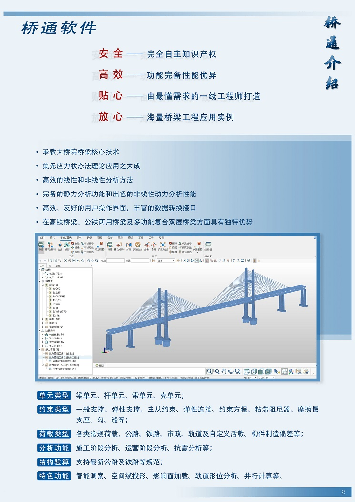

## 01. 桥通软件简介

桥通是由**中铁大桥勘测设计院集团有限公司**（下文简称“大桥院”）自主研发的桥梁通用有限元分析软件。该软件继承了大桥院软件的核心技术，功能完备、性能卓越，适用于任何桥型从设计、施工到运维的全过程受力分析，支持公路、铁路、市政等行业规范，在设计、施工、科研等单位均具有广泛的应用场景。软件名称“桥通”既是对软件功能的概括，也是对武汉长江大桥 **“一桥飞架南北，天堑变通途”** 建桥精神的传承。

该软件在 Windows 环境下开发，集成了用户交互建模界面、三维图形引擎、动态双向交互式二维图形引擎、高效的数据库存取技术、卓越的求解性能、强大的后处理等功能模块。软件由一线工程师打造，贴合实际需求。软件操作界面与商业软件无缝衔接，不改变用户习惯，零成本上手，数据格式与商业软件互认互导。桥通的有限元计算内核经过数十年、数百座桥梁的检验，计算结果准确可靠。

## 1.1软件环境

软件已测试通过的电脑操作系统包括： Windows8, Windows10，Windows11，支撑环境为Mcrosoft.NET FrameWork 9.0。

## 1.2软件安装、运行和卸载

- **软件下载：** [点击下载](https://www.brdi.com.cn/list/91.html "https://www.brdi.com.cn/list/91.html")
- **软件安装：** 点击安装包中的Setup.exe开始安装，若用户未安装Microsoft.NET FrameWork4.8，则提示安装后再继续。软件默认安装路径为：C:\\Program Files\\BRDI\\桥通\\，用户可根据需要修改安装路径。安装后，会在桌面和开始菜单生成快捷图标。
- **软件卸载：** 点击开始>所有程序>桥通>卸载。
- **在线升级：** 针对软件版本的升级，我们提供了在线升级功能，根据需要可以选择覆盖或者重装软件。

## 1.3软件特点

[软件特点视频介绍](https://www.bilibili.com/video/BV1ap4y1T7Zz/?share_source=copy_web&vd_source=c556459924185cc3d2902367720ea181)

