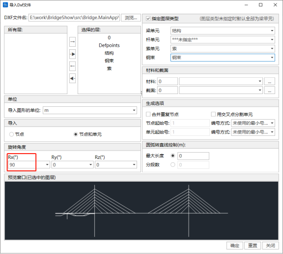

# 03. 项目、文件和数据管理

## 3.1 基本操作

### 新建项目
- 命令：主菜单栏>文件>新建
- 图标菜单：
- 快捷键：Ctrl+N

点击新建工程后，软件自动创建模型数据。

### 打开项目
- 命令：主菜单栏>文件>打开
- 图标菜单：
- 快捷键：Ctrl+O

选择打开项目后弹出文件打开对话框，选择所需的 \*.bfmd工程文件，单击打开即可打开相应工程。

### 打开项目目录
- 命令：主菜单栏>文件>打开项目目录
- 快捷键：Ctrl+P

选择 \*.bfmd工程文件，即可打开相应工程。

### 保存/另存为
- 命令：主菜单栏>文件>保存/另存为
- 图标菜单：
  
  
- 快捷键：Ctrl+S

保存当前项目到数据库。首次保存需要输入项目名称和文件路径，保存现有项目将直接替换为当前项目。如果点击另存为，需要重新输入项目名称和路径存储为新的数据库。

### 关闭项目
- 命令：主菜单栏>文件>关闭
- 图标菜单：

关闭当前项目，如果工程数据经过修改，关闭前会弹出对话框，询问是否保存修改，如果选择是，将会自动保存数据，选择否,则不会保存数据。

### 保存当前阶段为
- 命令：主菜单栏>文件>保存当前阶段为
- 图标菜单：

可将在当前施工阶段的模型另存，一般可用于对某个施工阶段单独进行分析。

### 最近打开的模型
- 命令：主菜单栏>文件>最近打开的模型
- 图标菜单：

最近打开的模型列表中将会显示3个最近使用的项目文件名。选择 \*.bfmd文件，即可打开相应项目。

### 退出
- 命令：主菜单栏>文件>退出
- 图标菜单：

直接退出应用程序并关闭所有进程。

## 3.2 导入导出

### 导入Midas数据
- 命令：主菜单栏>文件>导入>MIDAS(.mct)

选择Midas(.mct)模型文件，双击即可导入模型。仅支持9.1.0及9.3.0版本。
- 不支持导入的内容详见报错提示

### 导入Dxf图形
- 命令：主菜单栏>文件>导入>Dxf文件(.dxf)

弹出导入Dxf文件对话框，选择DXF文件，选择图形的层，选择导入节点、单元、材料、截面等数据，旋转角度等，即可在预览窗口中查看导入的图形，点击确定按钮导入图形。
如需将dxf中的Y轴转为空间Z轴，Rx转角输入90°

### 导出Midas数据
- 命令：主菜单栏>文件>导出>MIDAS(.mct)

输入文件名即可导出为Midas模型文件，该文件可在Midas软件中打开。
- 不支持导出的内容详见报错提示

### 导出3DBridge数据
- 命令：主菜单栏>文件>导出> 3DBrdige(.3db)文件

输入文件名即可导出为3DBridge(.3db)文件，该文件可在大桥院自主研发的3DBridge软件中打开。

### 合并模型
- 命令：主菜单栏>文件>合并模型（ \*.bfmd）

合并当前模型数据文件和其它模型数据文件。点击浏览选择需要合并的模型即可将对应模型合并到当前模型。

合并模型信息包括节点、单元、材料、截面、厚度。合并模型时可以选择模型起点，和模型旋转方向Rx,Ry,Rz。生成选项中可以设置合并重复节点、交叉分割选项，并提供了节点和单元的编号方式。

## 3.3 项目信息

点击项目信息，出现总控设置窗口，在计算信息栏输入项目名称、设计单位、计算人员、复核人员信息，在基本数据栏，设置重力加速度和设计温度。并填写详细的项目描述。即可完成项目信息设置。

## 3.4 文件管理

用户新建项目后应尽快保存，保存后生成模型数据库文件 \*.bfmd。模型计算成功后将生成以项目名称命名的结果文件夹，该文件夹中包含各类结果文件，和中间数据文件。

| 模块 | 文件名 | 文件类型 | 说明 |
|------|--------|----------|------|
| 静力分析模块 | \*.bfmd | 模型文件 | 包含用户建立的有限元模型信息 |
| | \*.bfmd.bak | 模型备份文件 | 执行保存操作后，软件自动生成 |
| | 项目命名文件夹/ \*.srd | 结果文件 | 施工阶段结果文件 |
| | 项目命名文件夹/ \*.erd | 结果文件 | 施工包络结果文件 |
| | 项目命名文件夹/ \*.ard | 结果文件 | 附加荷载分析结果文件 |
| | 项目命名文件夹/ \*.scrd | 结果文件 | 支座沉降分析结果文件 |
| | 项目命名文件夹/ \*.mrd | 结果文件 | 移动荷载分析结果文件 |
