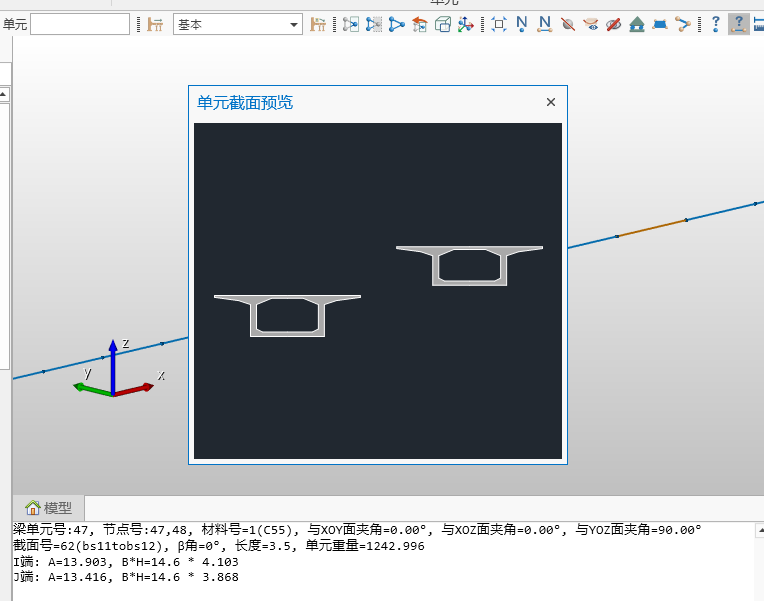
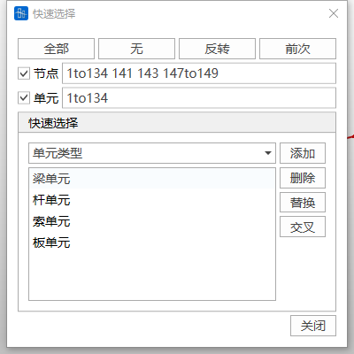
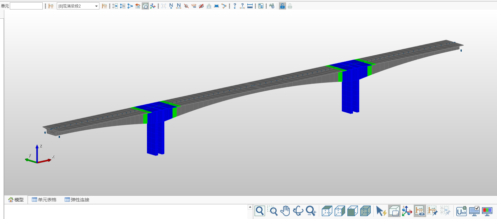
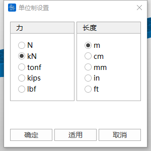
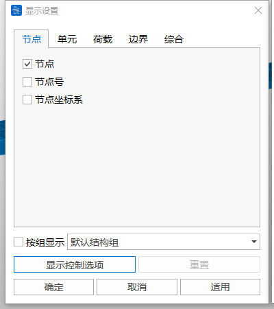
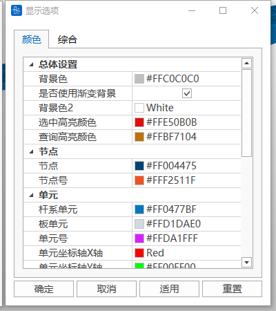
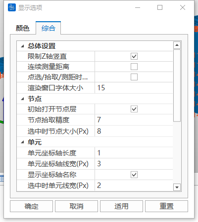
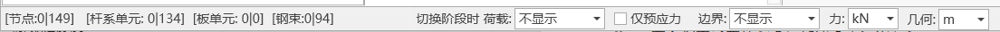

# 04. 视图

## 4.1 选择

### 4.1.1 单选
在模型窗口中，将鼠标光标移动到目标节点或单元附近，单击左键逐个选择节点或单元。再次点击已选中的节点或单元可取消选择。

### 4.1.2 框选
在模型窗口中按住鼠标左键拖动形成选择框，框内的节点或单元将被选中。

### 4.1.3 窗口解除选择
在模型窗口中拖动形成选择框，取消框内已选中的节点或单元。

### 4.1.4 全选
选中模型中的所有节点和单元。

### 4.1.5 取消全选
清除所有已选中的节点和单元。

### 4.1.6 恢复前次选择
恢复最近一次的选择集状态。

## 4.2 激活/钝化

通过激活或钝化功能，可在模型窗口中仅显示指定部分的模型，提高模型操作的聚焦性。

### 4.2.1 激活
选择目标节点或单元，点击"激活"按钮后，仅显示被选中的部分。

### 4.2.2 钝化
选择目标节点或单元，点击"钝化"按钮后，将隐藏被选中的部分。

### 4.2.3 全部激活
恢复显示模型中所有被钝化的节点和单元。

### 4.2.4 前次激活
回到最近一次激活/钝化操作的状态。

## 4.3 消隐
隐藏模型结构的单元线，显示单元厚度和截面形状，以便更清晰地观察模型的实际几何效果。

## 4.4 单元坐标系
显示每个单元的局部坐标系，使用 X、Y、Z 表示各坐标轴方向。

## 4.5 观察缩小单元后的形状
仅在消隐状态下可用，用于观察缩小单元后的形状，便于更清晰地查看节点与单元的空间关系。

## 4.6 显示ID

### 4.6.1 显示节点ID
在模型窗口中显示每个节点的编号。

### 4.6.2 显示单元ID
在模型窗口中显示每个单元的编号。

## 4.7 隐藏节点
隐藏模型窗口中节点的显示，使模型观察更加直观、聚焦于其他要素。

## 4.8 显示所有钢束
在模型窗口中显示定义的所有钢束形状，便于整体检查钢束布置情况。

## 4.9 隐藏钢束名称
隐藏模型窗口中显示的钢束名称，简化模型视图。

## 4.10 显示所有边界
在模型窗口中显示模型中定义的所有边界条件。

## 4.11 激活所有板单元
激活模型中的所有板单元并使其可见。

## 4.12 激活所有线单元
激活模型中的所有线单元并使其可见。

## 4.13 查询

### 4.13.1 查询节点
点击"查询节点"后，选取模型中的任意节点，信息窗口将显示该节点的编号以及其在 X、Y、Z 三轴上的坐标值。

### 4.13.2 查询单元
点击"查询单元"后，选取模型中的任意单元，信息窗口将显示该单元的详细信息，包括 I、J 端节点号、截面号等，同时支持单元截面预览。

### 4.13.3 查询距离
在模型窗口中依次点击两个节点，信息窗口将显示两节点之间的直线距离以及沿 X、Y、Z 三方向的相对距离。

## 4.14 树形菜单

### 4.14.1 工作
列出从建模到分析、设计的一系列工作流程。右键点击每个步骤，可选择对应的功能操作。

### 4.14.2 组
展示模型中设置的结构组、荷载组、边界组和钢束组等信息，便于查看和管理。

### 4.14.3 表格
列出与结构相关的多项表格信息，例如节点表格、单元表格和特性值表格，供快速查询和编辑。

### 4.14.4 树形菜单二
在屏幕右侧可展开第二个树形菜单，用于显示额外的功能或信息。

## 4.15 分析

### 4.15.1 运行分析
启动计算，进行模型的分析运算。

### 4.15.2 前处理
切换到前处理环境，可进行模型创建、参数设置、荷载施加等操作。

### 4.15.3 后处理
切换到后处理环境，用于查看分析结果，例如应力分布、位移情况等，进行结构检算、生成计算书，并支持数据可视化功能。

## 4.16 窗口显示

### 4.16.1 自动缩放
将当前激活的模型自动调整为适合窗口大小的比例，确保模型完整显示。

### 4.16.2 窗口缩放
在窗口中点击形成矩形区域，放大该区域以查看细节。

### 4.16.3 动态平移
通过鼠标拖拽，将模型向拖拽方向移动。

### 4.16.4 动态旋转
通过鼠标拖拽旋转模型，使其按照拖拽方向动态旋转，调整视角。

### 4.16.5 动态缩放
通过鼠标拖拽上下移动进行缩放，向上拖拽放大，向下拖拽缩小。

### 4.16.6 顶面视图
切换为从+Z方向俯视模型的视图。

### 4.16.7 右视图
切换为从+X方向观察模型的视图。

### 4.16.8 前视图
切换为从-Y方向观察模型的视图。

### 4.16.9 空间视图
切换为模型的等轴视图，提供三维立体观察效果。

## 4.17 快速选择
根据单元类型、材料属性、截面特性或厚度等条件快速选择模型中的节点或单元，提高选择效率。

## 4.18 施工阶段全部显示
选择某一施工阶段，点击"施工阶段全部显示"后，模型窗口将显示所有施工阶段的模型（灰色：尚未激活的部分，绿色：当前施工阶段激活的部分，蓝色：已完成激活的部分）。

## 4.19 施工阶段缩放固定
开启该功能后，切换施工阶段时，模型显示比例保持不变。若未启用该功能，切换施工荷载时，模型将自动根据当前施工阶段激活结构调整显示比例，使当前激活结构充满工作窗口。

## 4.20 单位制设置
可更改软件的显示单位制，例如长度、力或其他物理量的单位，以满足不同需求。

## 4.21 显示

### 4.21.1 显示设置
提供界面显示的整体设置。

按组显示：可预先定义结构组（例如荷载组、边界组）。勾选后，仅显示所选组的结果，包括单元编号、荷载或分析结果等。

### 4.21.2 显示选项
可调整界面的显示参数。例如界面配色方案、节点拾取精度、单元坐标轴显示设置等。

## 4.22 信息窗口
显示建模与分析过程中的操作信息，包括操作日志、警告提示和错误信息，便于追踪和检查模型状态。

## 4.23 信息条
显示模型的整体状态信息，比如总节点数、单元数等，此外，信息条提供了选择切换阶段时荷载是否显示、边界是否显示、单位制快速切换等功能，提高操作效率。

